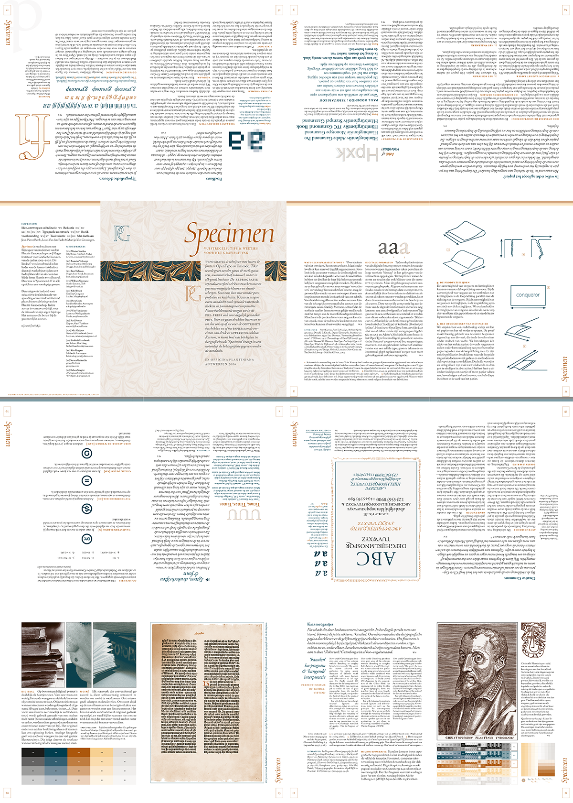
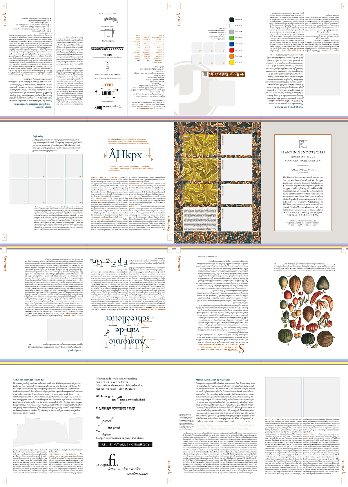
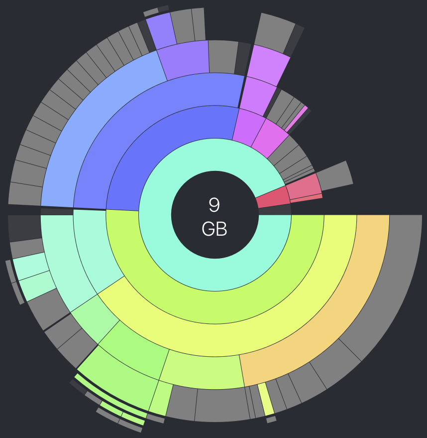

# PG Specimen

This repository is a provisory placeholder for the digital archive to _Specimen. Vuistregels voor het grafisch vak_ (Antwerp: Museum Plantin-Moretus, 2006).

_Specimen_ simultaneously is a two-sided DIN A1 broadsheet and a 32-pages brochure briefly discussing miscellaneous subjects of printing technology, book binding, pre-press, DTP, graphic design, type and typography. It was put together from January till May, 2006, by [students](http://www.plantininstituut.be/nl/alumni/) at the [Plantin Genootschap](http://www.plantininstituut.be/), class of 2005–2007.

The occasion for the initiative was a company visit to the show-rooms of Plantin NV (Evere, Brussels), dealer in Belgium of Heidelberg printing presses, where the brochure was printed on the then most advanced eight-color offset printing press.

Employing both CMYK (recto) and color separations using custom PMS spot colors only (verso), while showing off several different rasterization techniques at different lineatures, and displaying then newly emerging OpenType fonts, _Specimen_ at once also is a unique sampling of printing techniques. (I still feel my stress when at the moment the whole thing got to be printed, during the visit, it turned out I had been pushing things maybe somewhat too far: combining spot color separations with high-end stochastic FM rasterization was a typographic first, which was a challenge, even to Heidelberger printing and pre-press experts.)

The students who took the initiative to and collaborated on _Specimen_ would shortly after their graduation also become the organizers of the first [_Typosium_](https://www.initiaal.be/portfolio/), a yearly Plantin Genootschap get-together and symposium dedicated to typography and book publishing in Belgium and the Netherlands.

Editorial collaborators were Wouter Soudan, Brandon Verhaege, Bert Nelissen, Wilbert Verstraete, Kiki Rörsch, Davy Geets, Wim Vandamme, Roel Peeters, Mia Muijsers, Liesbeth Hazebroek, Kris Kuypers, Steven Vanhercke, and Ruben Stragier. _Specimen_’s final editing, design and prepress was done by me, Wouter Soudan. Louis Van den Eede,  the Plantin Genootschap’s _éminence grise_, provided highly appreciated typographic advice. Jean-Pierre Berth of Plantin NV took care of the generous realization into print. Special thanks went to Plantin Genootschap’s Martijn Van Groningen for his help with logistics.

## Todo

The full digital archive to _Specimen_ is stored on my backup drives, containing [645 files, 9Gb in total](README-files/file-tree.log). Currently this repository only contains the [final PDFs](PDF/), along with the [InDesign source files](src/) and graphic assets.

For ease of online browsing, c.q. display on screen, flattened renderings of both [recto](PG_Specimen_GVD_Impositie_Recto.pdf.png) and [verso](PG_Specimen_GVD_Impositie_Verso.pdf.png) sides are also included as high-res png images in RGB color space, original dimensions (500×700mm) at 300ppi.

If Github (or some other archive hosting service) would ever start offering free opensource giga-size repositories, in a more convenient way (than [Git Large Storage](https://git-lfs.github.com)), decentralized and/or distributed ([IPFS](https://ipfs.io)-style), and reliably time-enduring, I plan on doing a full dump of the entire folder.

